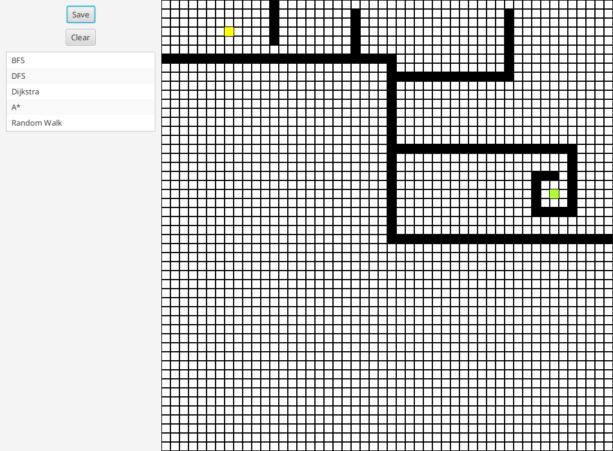
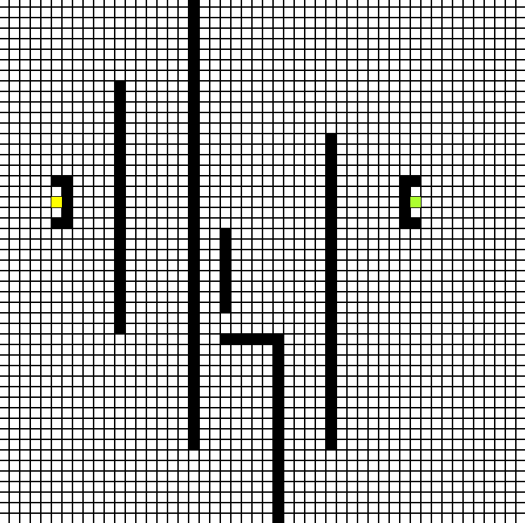

# Pathfinding algorithms

## Project Description
This is a desktop application for pathfinding algorithms visualization.

## Showcase

#### A* algorithm

#### Dijkstra algorithm

##### Demo is much more lagged than application.

## Contributors :turtle:
<table>
  <tr>
    <td align="center"><a href="https://github.com/kraleppa"> <b>Krzysztof Nalepa</b></a> </td>
  </tr>
</table>
